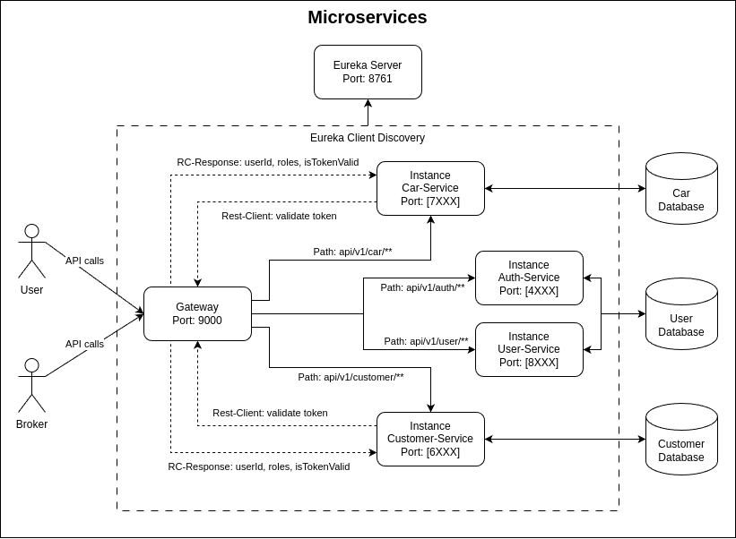
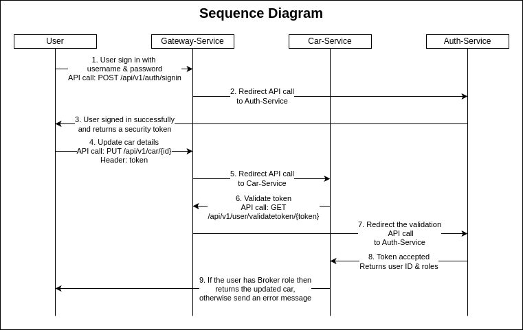

# Car Lease Demo with Springboot

This demo demonstrate use the Springboot microservices architecture with a car lease demo as an example.

The picture above is a simple representation of the microservice architecture.

Please note that Car-Service and Customer-Service do not know how to handle user authorization. This is only done by the Auth-Service. The Atuh-Service is able to extract the username from a security token. The username is then looked up in the database to obtain the user details such as user roles. These rolls are returned to the Car-Service. Then, the Car-Service can process the user request with access role correctly. Below is explained with sequence diagram how the the Car-Service can be accessed correctly without the need to validate the user.

For convenience, a simple sequence diagram is shown here to understand how the gateway redirects api calls.

1) First the user must be signed in with username and password via the gateway. The api call is "POST: /api/v1/auth/signin".

2) The gateway redirect the call to one of the User-Service instances.

3) The User-Service has accepted the sign in and returns a security token.

4) The user wants to update the car details. The api call is then "PUT: /api/v1/car/{id}" and send it with the received security token in the HTTP header.

5) The gateway redirect the call to one of the Car-Service instances.

6) The car service needs to know if the user has access rights to update the car. So it sends an API call to the Gateway-Service "GET: /api/v1/user/validatetoken/{token}".

7) The gateway redirect the api call to one of the Auth-Service instances.

8) The User-Service validates the token and returns the user id and roles to the Car-Service, if the token was extracted successfully.

9) The Car-Service now checks if the received user role contains "ROLE_BROKER". If it does, then returns the updated car details, otherwise returns an error message with HTTP status code "ACCESS DENIED".

<b>Eureka Server</b>

Eureka Server is an application that holds the information about all client-service instances. Every Micro service will register into the Eureka server and Eureka server knows all the client applications running on each port and IP address. Eureka Server is also known as Discovery Server.

All instances can be monitored on the Eureka server at:

	http://localhost:8761

<b>gateway-service</b>

The gateway is a microservice that runs on port 9000. The gateway redirects all requests from the user to other instances.

The following path or end points are redirected to instances:
	
	Path '/api/v1/user/**'		-> User-service
	Path '/api/v1/auth/**'		-> Auth-service
	Path '/api/v1/car/**'		-> Car-service
	Path '/api/v1/customer/**'	-> Customer-service

<b>Auth-Service instances</b>

Multiple Auth-Service instances are running concurrently in the range of ports 4XXX.

<b>User-Service instances</b>

Multiple User-Service instances are running concurrently in the range of ports 8XXX.

<b>Customer-Service</b>

Multiple Customer-Service instances are running concurrently in the range of ports 6XXX.

<b>Car-Service</b>

Multiple Car-Service instances are running concurrently in the range of ports 7XXX.

## Demonstration of the Car Lease Application

This demonstration contains scripts that only works for Linux.

Docker MySQL is used to create the MySQL database.

Run the script below to build Docker image for MySQL Database:

	$ cd {project_path}/docker
	$ mysql_docker.sh -b

Run the script below to run Docker image for MySQL Database (append -d to run detached):

	$ cd {project_path}/docker
	$ mysql_docker.sh -n

Run the script below to stop Docker image for MySQL Database:

	$ cd {project_path}/docker
	$ mysql_docker.sh -q

The database use default port 3306.

The default username is 'root' and the default password is 'super'.
This file 'application.properties' also contains this username and password.

If you don't have Linux then build docker image manually (you must install docker first on your machine before continue):

	$ docker pull mysql:8.0
	$ docker run --name mysql8 -p 3306:3306 -e MYSQL_ROOT_PASSWORD=super mysql:8.0

Follow below the instructions and run each java application in separate terminals.

	$ cd {project_path}/eureka-server
	$ ./gradlew clean
	$ ./gradlew bootJar
	$ java -jar build/libs/eureka-server-0.0.1-SNAPSHOT.jar
	
Open http://localhost:8761 on any browser.
	
	$ cd {project_path}/gateway
	$ ./gradlew clean
	$ ./gradlew bootJar
	$ java -jar build/libs/gateway-0.0.1-SNAPSHOT.jar
	
Open http://localhost:9000/actuator on any browser.

	$ cd {project_path}/services/user-service
	$ ./gradlew clean
	$ ./gradlew bootJar
	$ SERVER_PORT=8001 java -jar build/libs/user-service-0.0.1-SNAPSHOT.jar
	$ SERVER_PORT=8002 java -jar build/libs/user-service-0.0.1-SNAPSHOT.jar
	$ SERVER_PORT=8003 java -jar build/libs/user-service-0.0.1-SNAPSHOT.jar
	
Open http://localhost:8001/api/v1/user/greet on any browser.

	Displays:
		Welcome from 'USER-SERVICE'! ; Port: 8001
	
Open http://localhost:8002/api/v1/user/greet on any browser.

	Displays:
		Welcome from 'USER-SERVICE'! ; Port: 8002
	
Open http://localhost:8003/api/v1/user/greet on any browser.

	Displays:
		Welcome from 'USER-SERVICE'! ; Port: 8003
	
Open http://localhost:9000/api/v1/user/greet on any browser and refresh it several times.

	Displays:
		Welcome from 'USER-SERVICE'! ; Port: 8001
		or
		Welcome from 'USER-SERVICE'! ; Port: 8002
		or
		Welcome from 'USER-SERVICE'! ; Port: 8003

	$ cd {project_path}/services/car-service
	$ ./gradlew clean
	$ ./gradlew bootJar
	$ SERVER_PORT=7001 java -jar build/libs/car-service-0.0.1-SNAPSHOT.jar
	$ SERVER_PORT=7002 java -jar build/libs/car-service-0.0.1-SNAPSHOT.jar
	$ SERVER_PORT=7003 java -jar build/libs/car-service-0.0.1-SNAPSHOT.jar
	
Open http://localhost:7001/api/v1/car/greet on any browser.

	Displays:
		Welcome from 'CAR-SERVICE'! ; Port: 7001
	
Open http://localhost:7002/api/v1/car/greet on any browser.

	Displays:
		Welcome from 'CAR-SERVICE'! ; Port: 7002
	
Open http://localhost:7003/api/v1/car/greet on any browser.

	Displays:
		Welcome from 'CAR-SERVICE'! ; Port: 7003
	
Open http://localhost:9000/api/v1/car/greet on any browser and refresh it several times.

	Displays:
		Welcome from 'CAR-SERVICE'! ; Port: 7001
		or
		Welcome from 'CAR-SERVICE'! ; Port: 7002
		or
		Welcome from 'CAR-SERVICE'! ; Port: 7003
	
	$ cd {project_path}/services/customer-service
	$ ./gradlew clean
	$ ./gradlew bootJar
	$ SERVER_PORT=6001 java -jar build/libs/customer-service-0.0.1-SNAPSHOT.jar
	$ SERVER_PORT=6002 java -jar build/libs/customer-service-0.0.1-SNAPSHOT.jar
	$ SERVER_PORT=6003 java -jar build/libs/customer-service-0.0.1-SNAPSHOT.jar
	
Open http://localhost:6001/api/v1/customer/greet on any browser.

	Displays:
		Welcome from 'CUSTOMER-SERVICE'! ; Port: 6001
	
Open http://localhost:6002/api/v1/customer/greet on any browser.

	Displays:
		Welcome from 'CUSTOMER-SERVICE'! ; Port: 6002
	
Open http://localhost:6003/api/v1/customer/greet on any browser.

	Displays:
		Welcome from 'CUSTOMER-SERVICE'! ; Port: 6003
	
Open http://localhost:9000/api/v1/customer/greet on any browser and refresh it several times.

	Displays:
		Welcome from 'CUSTOMER-SERVICE'! ; Port: 6001
		or
		Welcome from 'CUSTOMER-SERVICE'! ; Port: 6002
		or
		Welcome from 'CUSTOMER-SERVICE'! ; Port: 6003
	

Swagger-UI:

	Open http://localhost:xxxx/swagger-ui/index.html

if credential are required:

	Username: root
	Password: secret

H2-Database Console:

	Open http://localhost:xxxx/h2-console

	Click on "Connect"

	jdbc url: jdbc:h2:mem:testdb
	Password is blank for now

